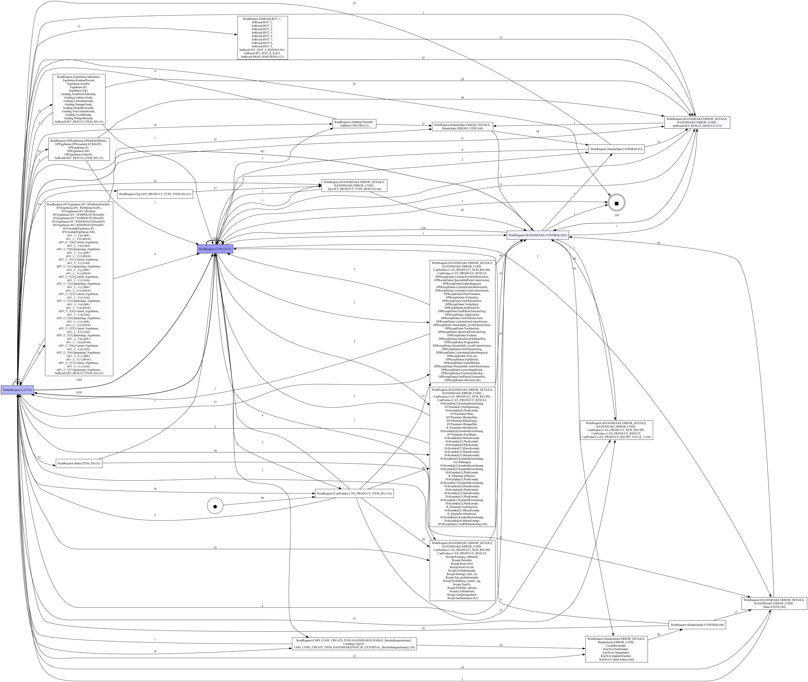

# Process Mining on OPC UA Network Traffic 

This notebook presents a detailed exploration of process mining techniques applied to OPC UA (Open Platform Communications Unified Architecture) network traffic. OPC UA is a machine-to-machine communication protocol for industrial automation, and this analysis aims to uncover hidden patterns, and process flows within the network traffic data.


## 1. Dependencies and Imports

Before we begin the analysis, we need to install and import necessary libraries and modules. The following cells handle this setup.


```python
!pip install pm4py
!pip install graphviz
!pip install pydot
```


### Python Libraries


```python
# Import necessary libraries
import json
import datetime
import psutil
import time
import csv
import matplotlib.pyplot as plt
import pm4py
import pandas as pd
import re
import networkx as nx
import numpy as np
from numpy.polynomial.polynomial import Polynomial
from pm4py.util import constants
from IPython.display import display, Image
from pm4py.algo.filtering.dfg import dfg_filtering
from pm4py.visualization.dfg import visualizer as dfg_visualizer
from pm4py.algo.evaluation.generalization import algorithm as generalization_evaluator
from pm4py.algo.evaluation.simplicity import algorithm as simplicity_evaluator
from pm4py.algo.conformance.tokenreplay.diagnostics import root_cause_analysis
from pm4py.visualization.decisiontree import visualizer as dt_vis
from pm4py.algo.transformation.log_to_features import algorithm as log_to_features
from pm4py.algo.conformance.alignments.petri_net import algorithm as alignments
from pm4py.algo.conformance import alignments as conformance_alignments
from pm4py.algo.discovery.log_skeleton import algorithm as lsk_discovery
from pm4py.algo.conformance.log_skeleton import algorithm as lsk_conformance
from pm4py.algo.conformance.tokenreplay.diagnostics import duration_diagnostics
from pm4py.algo.organizational_mining.sna import util
from pm4py.algo.conformance.tokenreplay import algorithm as token_based_replay
from pm4py.statistics.traces.generic.log import case_arrival
from pm4py.algo.organizational_mining.local_diagnostics import algorithm as local_diagnostics
from pm4py.objects.conversion.process_tree import converter as pt_converter
from pm4py.algo.discovery.temporal_profile import algorithm as temporal_profile_discovery
from pm4py.algo.conformance.temporal_profile import algorithm as temporal_profile_conformance
from pm4py.visualization.petri_net import visualizer as pn_visualizer
from sklearn.decomposition import PCA
from sklearn.ensemble import IsolationForest
from pm4py.statistics.traces.generic.log import case_statistics
from pm4py.visualization.graphs import visualizer as graphs_visualizer

# Define the input file path
input_file = './opcua.json'

```


## 2. Understanding the Network Traffic Data


```python
# Load the provided JSON data
with open(input_file, "r") as f:
    opcua_json = json.load(f)

# Extract source and destination IP addresses and ports
comm_pairs = []

for entry in data:
    layers = entry.get('_source', {}).get('layers', {})
    
    # Extract IP and port information
    src_ip = layers.get('ip', {}).get('ip.src')
    dst_ip = layers.get('ip', {}).get('ip.dst')
    src_port = layers.get('tcp', {}).get('tcp.srcport')
    dst_port = layers.get('tcp', {}).get('tcp.dstport')
    
    if src_ip and dst_ip and src_port and dst_port:
        comm_pairs.append((src_ip + ':' + src_port, dst_ip + ':' + dst_port))

# Create a new graph for the modified hierarchy
G_modified = nx.Graph()

# Add edges from port (IP:port) to its associated IP
for src, dst in comm_pairs:
    src_ip, src_port = src.split(':')
    dst_ip, dst_port = dst.split(':')
    
    # Add edge from port (IP:port) to its IP
    G_modified.add_edge(src, src_ip)
    G_modified.add_edge(dst, dst_ip)
    
    # Add edge between source port and destination port
    G_modified.add_edge(src, dst)

    
# Assign colors to nodes
modified_node_colors = []
for node in G_modified.nodes():
    if ':' in node:  # This means it's a port (IP:port combination)
        modified_node_colors.append('#b2b2b2')  # Color for ports
    else:
        modified_node_colors.append('#44AA99')  # Color for IP addresses

modified_node_sizes = [2500 if ':' in node else 8000 for node in G_modified.nodes()]

# Define labels for the nodes
labels = {}
for node in G_modified.nodes():
    if ':' in node:  # This means it's a port (IP:port combination)
        labels[node] = node.split(':')[1]  # Only keep the port number
    else:
        labels[node] = node  # IP address

# Convert the graph to a directed graph
G_directed = nx.DiGraph(G_modified)

# Calculate the frequency of communications between ports
edge_freq = {}
for src, dst in comm_pairs:
    if (src, dst) in edge_freq:
        edge_freq[(src, dst)] += 1
    else:
        edge_freq[(src, dst)] = 1

# Remove directed edges between port (IP:port) and its IP address
for src, dst in comm_pairs:
    src_ip, src_port = src.split(':')
    dst_ip, dst_port = dst.split(':')
    
    # Remove directed edge from port (IP:port) to its IP
    if G_directed.has_edge(src, src_ip):
        G_directed.remove_edge(src, src_ip)
    if G_directed.has_edge(dst, dst_ip):
        G_directed.remove_edge(dst, dst_ip)

# Draw the modified directed network graph with frequency edge labels
plt.figure(figsize=(19, 8))
pos_modified = nx.spring_layout(G_modified, k=0.5, iterations=1000)  # Positioning of nodes
nx.draw(
    G_directed,
    pos_modified,
    labels=labels,
    node_size=modified_node_sizes,
    node_color=modified_node_colors,
    font_size=10,
    width=0.5,
    edge_color="black",
    font_color='whitesmoke',
    arrowsize=20,
    connectionstyle="arc3,rad=0.1"
)
nx.draw_networkx_edge_labels(G_directed, pos_modified, edge_labels=edge_freq, font_size=9)

plt.savefig("network_graph.pdf", bbox_inches="tight")
plt.show()
```


    

    


```python
# Calculate key metrics
num_nodes = G_directed.number_of_nodes()
num_edges = G_directed.number_of_edges()
density = nx.density(G_directed)
degree_centrality = nx.degree_centrality(G_directed)

# Identify the top 5 nodes with the highest degree centrality
top_degree_centrality = sorted(degree_centrality.items(), key=lambda x: x[1], reverse=True)[:5]

# Display the calculated metrics
num_nodes, num_edges, density, top_degree_centrality

```


    (21,
     42,
     0.1,
     [('10.13.152.101:48010', 0.65),
      ('10.13.152.31', 0.45),
      ('10.13.152.102:48010', 0.45),
      ('10.13.152.114:48010', 0.35000000000000003),
      ('10.13.152.61', 0.2)])


## 3. OPCUA Packet Analyzer Definition

The `OPCUAPacketAnalyzer` class is responsible for analyzing OPC UA packets. It extracts relevant information from the packets and prepares the data for further processing.


```python
class OPCUAPacketAnalyzer:
    def __init__(self, input_file, num_packets):
        """
        Initialize the OPCUAPacketAnalyzer with the input file and the number of packets to analyze.

        Args:
            input_file (str): The path to the input JSON file.
            num_packets (int): The number of packets to analyze.
        """
        self.input_file = input_file
        self.opc_packets = self.load_data()[:num_packets]
        
    def load_data(self):
        """
        Load data from the JSON file.

        Returns:
            list: List of JSON data records.
        """
        with open(self.input_file, 'r') as file:
            return json.load(file)

    def extract_tcp_data(self, packet):
        """
        Extract TCP data from a packet.

        Args:
            packet (dict): A packet dictionary.

        Returns:
            list: List of extracted data.
        """
        return self.extract_data(packet, 'tcp', ['tcp.srcport', 'tcp.dstport'])

    def extract_ip_data(self, packet):
        """
        Extract IP data from a packet.

        Args:
            packet (dict): A packet dictionary.

        Returns:
            list: List of extracted data.
        """
        return self.extract_data(packet, 'ip', ['ip.src', 'ip.dst'])

    def extract_eth_data(self, packet):
        """
        Extract Ethernet data from a packet.

        Args:
            packet (dict): A packet dictionary.

        Returns:
            list: List of extracted data.
        """
        return self.extract_data(packet, 'eth', ['eth.src', 'eth.dst'])
            
    def extract_data(self, packet, layer, fields):
        """
        Extract data from a packet for a specified layer and fields.

        Args:
            packet (dict): A packet dictionary.
            layer (str): The layer to extract data from.
            fields (list): List of field names to extract.

        Returns:
            list: List of extracted data.
        """
        timestamp_str = packet["_source"]["layers"]["frame"]["frame.time"]
        timestamp = datetime.datetime.strptime(timestamp_str, "%b %d, %Y %H:%M:%S.%f000 %Z")
        return [timestamp] + [packet["_source"]["layers"][layer].get(field, '') for field in fields]

    def write_csv(self, filename, rows):
        """
        Write data to a CSV file.

        Args:
            filename (str): The name of the CSV file to write.
            rows (list): List of rows to write to the CSV file.
        """
        with open(filename, 'w', newline='') as file:
            writer = csv.writer(file)
            writer.writerows(rows)

    def analyze_packets(self):
        """
        Analyze OPC UA packets and write the results to CSV files.
        """
        matching_ip_ids = self.match_request_handles()
        transport_layer_log, network_layer_log, eth_layer_log, app_layer_log = [], [], [], []
        transport_layer_log.append(["time:timestamp", "case:concept:name", "concept:name"])
        network_layer_log.append(["time:timestamp", "case:concept:name", "concept:name"])
        eth_layer_log.append(["time:timestamp", "case:concept:name", "concept:name"])
        app_layer_log.append(["time:timestamp", "case:concept:name", "org:resource", "concept:name"])

        for packet in self.opc_packets:
            eth_layer_log.append(self.extract_eth_data(packet))
            network_layer_log.append(self.extract_ip_data(packet))
            transport_layer_log.append(self.extract_tcp_data(packet))
        
        matched_array = self.match_request_handles()
        tuples = self.add_case_id(matched_array)
        app_layer_log = self.transform_tuples(app_layer_log, tuples)
        
        self.write_csv('link_layer.csv', eth_layer_log)
        self.write_csv('network_layer.csv', network_layer_log)
        self.write_csv('transport_layer.csv', transport_layer_log)
        self.write_csv('app_layer.csv', app_layer_log)

    def match_request_handles(self):
        """
        Match request handles in OPC UA packets and create matched arrays.

        Returns:
            list: List of matched arrays.
        """
        request_array, response_array, matched_array = [], [], []

        for packet in self.opc_packets:
            if packet["_source"]["layers"]["opcua"]["opcua.transport.type"] == "MSG":
                encodable_object = packet["_source"]["layers"]["opcua"]["OpcUa Service : Encodeable Object"]
                connection_type, header = self.find_connection_type(encodable_object)
                if header:
                    request_handle = packet["_source"]["layers"]["opcua"]["OpcUa Service : Encodeable Object"][connection_type][f'{header}: {header}']["opcua.RequestHandle"]

                    # Extracting additional details
                    ip_src = packet["_source"]["layers"]["ip"]["ip.src"]
                    ip_dst = packet["_source"]["layers"]["ip"]["ip.dst"]
                    tcp_srcport = packet["_source"]["layers"]["tcp"]["tcp.srcport"]
                    tcp_dstport = packet["_source"]["layers"]["tcp"]["tcp.dstport"]
                    timestamp_str = packet["_source"]["layers"]["frame"]["frame.time"]
                    timestamp = datetime.datetime.strptime(timestamp_str, "%b %d, %Y %H:%M:%S.%f000 %Z")
                    nodes = self.get_nodes(encodable_object, connection_type)
                    
                    (request_array if header == "RequestHeader" else response_array).append([request_handle, ip_src, tcp_srcport, ip_dst, tcp_dstport, timestamp, connection_type, nodes])

        matched_array = [(x[5], f"{x[1]}:{x[2]}", f"{x[3]}:{x[4]}", x[6], [{k: v for k, v in zip(x[7], y[7])}]) for x in request_array for y in response_array if x[0] == y[0]]
        matched_array = sorted(matched_array, key=lambda x: x[0])
        return matched_array
    
    def find_connection_type(self, encodable_object):
        """
        Find the connection type and header in the encodable object.

        Args:
            encodable_object (dict): The encodable object dictionary.

        Returns:
            tuple: A tuple containing the connection type and header.
        """
        key_list = ["ReadRequest", "ReadResponse", "WriteRequest", "WriteResponse", "SubscribeRequest", "SubscribeResponse", "PublishRequest", "PublishResponse"]
        for key in key_list:
            if key in encodable_object.keys():
                header = "RequestHeader" if 'Request' in key else "ResponseHeader"
                return key, header
        return None, None
    
    def get_nodes(self, encodable_object, connection_type):
        """
        Extract node information based on the connection type.

        Args:
            encodable_object (dict): The encodable object dictionary.
            connection_type (str): The connection type.

        Returns:
            list: List of extracted node information.
        """
        nodes = []
        if connection_type == "ReadRequest" and "NodesToRead: Array of ReadValueId" in encodable_object[connection_type]:
            array_size = int(encodable_object[connection_type]["NodesToRead: Array of ReadValueId"]["opcua.variant.ArraySize"])
            for i in range(array_size):
                obj = encodable_object[connection_type]["NodesToRead: Array of ReadValueId"][f"[{i}]: ReadValueId"]["NodeId: NodeId"]
                node = obj["opcua.nodeid.string"] if "opcua.nodeid.string" in obj else obj["opcua.nodeid.numeric"]
                node = ".".join(node.split(".")[-2:]) if "." in node else node
                nodes.append(node)
        elif connection_type == "ReadResponse" and "Results: Array of DataValue" in encodable_object[connection_type]:
            array_size = int(encodable_object[connection_type]["Results: Array of DataValue"]["opcua.variant.ArraySize"])
            for i in range(array_size):
                obj = encodable_object[connection_type]["Results: Array of DataValue"][f"[{i}]: DataValue"]
                key = obj["Value: Variant"][list(obj["Value: Variant"].keys())[1]] if "Value: Variant" in obj else None
                nodes.append(key)
        elif connection_type == "WriteRequest" and "NodesToWrite: Array of WriteValue" in encodable_object[connection_type]:
            array_size = int(encodable_object[connection_type]["NodesToWrite: Array of WriteValue"]["opcua.variant.ArraySize"])
            for i in range(array_size):
                obj = encodable_object[connection_type]["NodesToWrite: Array of WriteValue"][f"[{i}]: WriteValue"]["NodeId: NodeId"]
                node = obj["opcua.nodeid.string"] if "opcua.nodeid.string" in obj else obj["opcua.nodeid.numeric"]
                node = ".".join(node.split(".")[-2:]) if "." in node else node
                nodes.append(node)
        elif connection_type == "WriteResponse" and "Results: Array of StatusCode" in encodable_object[connection_type]:
            array_size = int(encodable_object[connection_type]["Results: Array of StatusCode"]["opcua.variant.ArraySize"])
            for _ in range(array_size):
                nodes.append(encodable_object[connection_type]["Results: Array of StatusCode"]["opcua.Results"])
        return nodes

    def add_case_id(self, matched_array):
        """
        Add case IDs to the matched array.

        Args:
            matched_array (list): List of matched arrays.

        Returns:
            list: List of matched arrays with added case IDs.
        """
        ip_to_case_id = {}
        new_matched_array = []

        for tup in matched_array:
            ip = tup[2].split(":")[0]
            dictionaries = tup[4]

            # Check if any dictionary contains a key with "CAN_PRODUCE_ITEM_ID"
            case_id = None
            for dictionary in dictionaries:
                if "CanProduce.CAN_PRODUCE_ITEM_ID" in dictionary.keys():
                    case_id = dictionary.get("CanProduce.CAN_PRODUCE_ITEM_ID")
                    ip_to_case_id[ip] = case_id  # Store the case id for this IP
                    break

            # If we didn't find a "CAN_PRODUCE_ITEM_ID", use the previously stored case id for this IP
            if case_id is None:
                case_id = ip_to_case_id.get(ip, None)

            # Create a new tuple with the added case id
            new_tup = (*tup, case_id)
            new_matched_array.append(new_tup)

        return new_matched_array

    def transform_tuples(self, app_layer_log, tuples_list):
        """
        Transform tuples and add them to the app layer log.

        Args:
            app_layer_log (list): List of app layer log entries.
            tuples_list (list): List of tuples to transform and add.

        Returns:
            list: Updated app layer log.
        """
        for tup in tuples_list:
            # Extract relevant information
            timestamp = tup[0]
            case_id = tup[5]
            ip_address = tup[2].split(":")[0]
            request_type = tup[3]
            request_keys = [str(k) for k in tup[4][0].keys()]

            # Form the new list with the extracted information
            new_list = [timestamp, case_id, ip_address, request_type + " (" + ", \n".join(request_keys) + ")"]
            app_layer_log.append(new_list)

        return app_layer_log

    def check_format(self, string, pattern):
        """
        Check if a string matches a specified pattern.

        Args:
            string (str): The string to check.
            pattern (str): The pattern to match.

        Returns:
            bool: True if the string matches the pattern, False otherwise.
        """
        return re.match(pattern, string) is not None

    def run(self):
        """
        Entry point to run the packet analysis.
        """
        start_time = time.time()  # Start the timer
        
        self.analyze_packets()
        
        end_time = time.time()  # End the timer
        cpu_usage = psutil.cpu_percent()
        ram_usage = psutil.virtual_memory().percent
        print(f"Time taken for packet analysis with {len(self.opc_packets)} packets: {end_time - start_time:.2f} seconds")
        print(f"CPU usage: {cpu_usage}%")
        print(f"RAM usage: {ram_usage}%")

```


## 4. Running the Packet Analyzer

With the `OPCUAPacketAnalyzer` class defined, we can now instantiate it and run the analysis on our input data.


```python
# Create an instance of OPCUAPacketAnalyzer
analyzer = OPCUAPacketAnalyzer(input_file, len(json.load(open(input_file))))

# Run the packet analysis
analyzer.run()

```

    Time taken for packet analysis with 24445 packets: 8.78 seconds
    CPU usage: 13.5%
    RAM usage: 71.6%


## 5. Data Transformation and Process Visualization

Once the packets are analyzed, we transform the data into a format suitable for process mining. We then visualize the directly-follows graph for the event log.


```python
# Read data from the CSV file into a DataFrame
dataframe = pd.read_csv("app_layer.csv", sep=",")

# Format the DataFrame for PM4Py
dataframe = pm4py.format_dataframe(dataframe, case_id="case:concept:name", activity_key="concept:name",
                                   timestamp_key="time:timestamp")

# Convert the formatted DataFrame to an event log
event_log = pm4py.convert_to_event_log(dataframe)

```

    /Users/philipempl/anaconda3/lib/python3.11/site-packages/pm4py/objects/log/util/dataframe_utils.py:180: UserWarning: Could not infer format, so each element will be parsed individually, falling back to `dateutil`. To ensure parsing is consistent and as-expected, please specify a format.
      df[col] = pd.to_datetime(df[col], utc=True)
    /Users/philipempl/anaconda3/lib/python3.11/site-packages/pm4py/objects/log/util/dataframe_utils.py:180: UserWarning: Could not infer format, so each element will be parsed individually, falling back to `dateutil`. To ensure parsing is consistent and as-expected, please specify a format.
      df[col] = pd.to_datetime(df[col], utc=True)
    /Users/philipempl/anaconda3/lib/python3.11/site-packages/pm4py/objects/log/util/dataframe_utils.py:180: UserWarning: Could not infer format, so each element will be parsed individually, falling back to `dateutil`. To ensure parsing is consistent and as-expected, please specify a format.
      df[col] = pd.to_datetime(df[col], utc=True)
    /Users/philipempl/anaconda3/lib/python3.11/site-packages/pm4py/utils.py:96: UserWarning: Some rows of the Pandas data frame have been removed because of empty case IDs, activity labels, or timestamps to ensure the correct functioning of PM4Py's algorithms.
      warnings.warn("Some rows of the Pandas data frame have been removed because of empty case IDs, activity labels, or timestamps to ensure the correct functioning of PM4Py's algorithms.")
    /Users/philipempl/anaconda3/lib/python3.11/site-packages/pm4py/utils.py:99: SettingWithCopyWarning: 
    A value is trying to be set on a copy of a slice from a DataFrame.
    Try using .loc[row_indexer,col_indexer] = value instead
    
    See the caveats in the documentation: https://pandas.pydata.org/pandas-docs/stable/user_guide/indexing.html#returning-a-view-versus-a-copy
      df[constants.CASE_CONCEPT_NAME] = df[constants.CASE_CONCEPT_NAME].astype("string")
    /Users/philipempl/anaconda3/lib/python3.11/site-packages/pm4py/utils.py:101: SettingWithCopyWarning: 
    A value is trying to be set on a copy of a slice from a DataFrame.
    Try using .loc[row_indexer,col_indexer] = value instead
    
    See the caveats in the documentation: https://pandas.pydata.org/pandas-docs/stable/user_guide/indexing.html#returning-a-view-versus-a-copy
      df[xes_constants.DEFAULT_NAME_KEY] = df[xes_constants.DEFAULT_NAME_KEY].astype("string")
    /Users/philipempl/anaconda3/lib/python3.11/site-packages/pm4py/utils.py:508: UserWarning: the EventLog class has been deprecated and will be removed in a future release.
      warnings.warn("the EventLog class has been deprecated and will be removed in a future release.")


### Directly-Follows-Graph


```python
# Discover the Directly Follows Graph from the event log
_df, _sa, _ea = pm4py.discover_directly_follows_graph(event_log)

# Save the Directly Follows Graph as an SVG file
pm4py.save_vis_dfg(_df, _sa, _ea, 'perf_dfg.svg')

# View the Directly Follows Graph as a PNG image
pm4py.view_dfg(_df, _sa, _ea, format="png")

```


    

    


### Inductive Miner


```python
# Discover a Petri net using the inductive miner algorithm with a noise threshold
im_net, im_im, im_fm = pm4py.discover_petri_net_inductive(event_log, noise_threshold=0.9)

# Create a visualization of the Petri net
gviz = pn_visualizer.apply(im_net, im_im, im_fm, log=event_log)

# View the Petri net visualization
pm4py.visualization.petri_net.visualizer.view(gviz)

```


    

    


### Heuristic Miner


```python
# Discover a Petri net using the heuristics miner algorithm with a dependency threshold
hm_net, hm_im, hm_fm = pm4py.discover_petri_net_heuristics(event_log, dependency_threshold=0.9)

# Generate a visualization of the Petri net with frequency-based variant and PNG format
viz_variant = pm4py.visualization.petri_net.visualizer.Variants.FREQUENCY
viz_parameters = {"format": "png"}
gviz = pm4py.visualization.petri_net.visualizer.apply(hm_net, hm_im, hm_fm, variant=viz_variant, parameters=viz_parameters)

# View the Petri net visualization
pm4py.visualization.petri_net.visualizer.view(gviz)

```


    

    


### Alpha Miner


```python
# Discover a Petri net using the alpha miner algorithm
am_net, am_im, am_fm = pm4py.discover_petri_net_alpha(event_log)

# Define visualization parameters
parameters = {pn_visualizer.Variants.FREQUENCY.value.Parameters.FORMAT: "png"}

# Generate the visualization of the Petri net using the alpha miner variant and specified parameters
gviz = pn_visualizer.apply(am_net, am_im, am_fm, parameters=parameters, variant=pn_visualizer.Variants.FREQUENCY, log=event_log)

# Save the Petri net visualization as a PDF file
pn_visualizer.save(gviz, "alpha-miner.pdf")

# View the Petri net visualization
pm4py.visualization.petri_net.visualizer.view(gviz)

```


    replaying log with TBR, completed variants ::   0%|          | 0/85 [00:00<?, ?it/s]


    

    


### BPMN 2.0


```python
# Discover a BPMN model using the inductive miner algorithm with a noise threshold
bpmn_model = pm4py.discover_bpmn_inductive(event_log, noise_threshold=0.98)

# Write the BPMN model to a BPMN file
pm4py.write_bpmn(bpmn_model, "model.bpmn")

# View the BPMN model
pm4py.view_bpmn(bpmn_model)

```


    

    


### Role Mining


```python
# Discover organizational roles from the event log
roles = pm4py.discover_organizational_roles(event_log)

# Print the discovered organizational roles
roles

```


    [Activities: ['PublishRequest ()', 'ReadRequest (2259)', 'ReadRequest (CanProduce.CAN_PRODUCE_ITEM_ID)', 'WriteRequest (HANDSHAKE.CONFIRM)', 'WriteRequest (HANDSHAKE.ERROR_DETAILS, \nHANDSHAKE.ERROR_CODE, \nSetResult.SET_RESULT_RESULT)'] Originators importance {'10.13.152.101': 7777, '10.13.152.102': 2100},
     Activities: ['ReadRequest (AddItem.ParentID, \nAddItem.CHILDID)', 'ReadRequest (CMD_CODE_CREATE_ITEM_HANDSHAKECHARGE_Beschriftungsautomat2, \nCreatItem.TypeNr, \nCMD_CODE_CREATE_ITEM_HANDSHAKEITEM_ID_EXTERNAL_Beschriftungsautomat2)', 'ReadRequest (DPErgebnisse.DPDruckDifferenz, \nDPErgebnisse.DPGesamteLECKRATE, \nDPErgebnisse.IO, \nDPErgebnisse.NIO, \nDPErgebnisse.FehlerNr, \nSetResult.SET_RESULT_ITEM_ID)', 'ReadRequest (Ergebnisse.SnKamera, \nErgebnisse.KontrastProzent, \nErgebnisse.ErorrNr, \nErgebnisse.IO, \nErgebnisse.NIO, \nGrading.AxialNonUniformity, \nGrading.Contrast_Grade, \nGrading.CorrectionGrade, \nGrading.DamageGrade, \nGrading.ModulationGrade, \nGrading.NonUniformGrade, \nGrading.OverallGrade, \nGrading.PrintgrothGrade, \nSetResult.SET_RESULT_ITEM_ID)', 'ReadRequest (HVErgebnisse.HV_RDifferenzNachHv, \nHVErgebnisse.HV_RDifferenzVorHv, \nHVErgebnisse.HV_REinheit, \nHVErgebnisse.HV_TEMPERATURNachH, \nHVErgebnisse.HV_TEMPERATURVorHV, \nHVErgebnisse.HV_WIDERSTANDNachHV, \nHVErgebnisse.HV_WIDERSTANDVorHV, \nHVGesamteErgebnisse.IO, \nHVGesamteErgebnisse.NIO, \nsHV_U_V[0].BtIO, \nsHV_U_V[0].BtNIO, \nsHV_U_V[0].Current_Ergebnisse, \nsHV_U_V[0].Error, \nsHV_U_V[0].Spannungs_Ergebnisse, \nsHV_U_V[1].BtIO, \nsHV_U_V[1].BtNIO, \nsHV_U_V[1].Current_Ergebnisse, \nsHV_U_V[1].Error, \nsHV_U_V[1].Spannungs_Ergebnisse, \nsHV_U_V[2].BtIO, \nsHV_U_V[2].BtNIO, \nsHV_U_V[2].Current_Ergebnisse, \nsHV_U_V[2].Error, \nsHV_U_V[2].Spannungs_Ergebnisse, \nsHV_U_V[3].BtIO, \nsHV_U_V[3].BtNIO, \nsHV_U_V[3].Current_Ergebnisse, \nsHV_U_V[3].Error, \nsHV_U_V[3].Spannungs_Ergebnisse, \nsHV_U_V[4].BtIO, \nsHV_U_V[4].BtNIO, \nsHV_U_V[4].Current_Ergebnisse, \nsHV_U_V[4].Error, \nsHV_U_V[4].Spannungs_Ergebnisse, \nsHV_U_V[5].BtIO, \nsHV_U_V[5].BtNIO, \nsHV_U_V[5].Current_Ergebnisse, \nsHV_U_V[5].Error, \nsHV_U_V[5].Spannungs_Ergebnisse, \nsHV_U_V[6].BtIO, \nsHV_U_V[6].BtNIO, \nsHV_U_V[6].Current_Ergebnisse, \nsHV_U_V[6].Error, \nsHV_U_V[6].Spannungs_Ergebnisse, \nsHV_U_V[7].BtIO, \nsHV_U_V[7].BtNIO, \nsHV_U_V[7].Current_Ergebnisse, \nsHV_U_V[7].Error, \nsHV_U_V[7].Spannungs_Ergebnisse, \nSetResult.SET_RESULT_ITEM_ID)', 'ReadRequest (Status.ITEM_ID)', 'ReadRequest (Typ.GET_PRODUCT_TYPE_ITEM_ID)', 'WriteRequest (HANDSHAKE.ERROR_DETAILS, \nHANDSHAKE.ERROR_CODE, \nCanProduce.CAN_PRODUCE_NEW_RECIPE, \nCanProduce.CAN_PRODUCE_RESULT, \nDPRezeptDaten.LeckrateZweiteObereGrenze, \nDPRezeptDaten.DruckabfallErsteUntereGrenze, \nDPRezeptDaten.Entlueftungszeit, \nDPRezeptDaten.LeckrateErsteObereGrenze, \nDPRezeptDaten.LeckrateZweiteUntereGrenze, \nDPRezeptDaten.PruefVolumen, \nDPRezeptDaten.Vorlaufzeit, \nDPRezeptDaten.GlobToleranzPos, \nDPRezeptDaten.Vorfuellzeit, \nDPRezeptDaten.fuellDruck30, \nDPRezeptDaten.FuellDruckToleranzNeg, \nDPRezeptDaten.Abgleichzeit, \nDPRezeptDaten.GlobToleranzAktiv, \nDPRezeptDaten.LeckrateErsteUntereGrenze, \nDPRezeptDaten.Druckabfall_zweiteObereGrenze, \nDPRezeptDaten.Nachlaufzeit, \nDPRezeptDaten.MessDruckToleranzNeg, \nDPRezeptDaten.Fuellzeit, \nDPRezeptDaten.MessDruckToleranzPos, \nDPRezeptDaten.ProgrammNr, \nDPRezeptDaten.Druckabfall_zweiteUntereGrenze, \nDPRezeptDaten.GlobToleranzNeg, \nDPRezeptDaten.LeckortungEntlueftungszeit, \nDPRezeptDaten.TestLeck, \nDPRezeptDaten.FuellDruck, \nDPRezeptDaten.VorfuellDruck, \nDPRezeptDaten.Druckabfall_ersteObereGrenze, \nDPRezeptDaten.LeckortungsDruck, \nDPRezeptDaten.ExternesEntlueften, \nDPRezeptDaten.FuellDruckToleranzPos, \nDPRezeptDaten.Messzeit)', 'WriteRequest (HANDSHAKE.ERROR_DETAILS, \nHANDSHAKE.ERROR_CODE, \nCanProduce.CAN_PRODUCE_NEW_RECIPE, \nCanProduce.CAN_PRODUCE_RESULT, \nHvKontakte[2].KundenBezeichnung, \nHVParameter.PruefSpannung, \nHvKontakte[4].PlusKontakt, \nHVParameter.IMax, \nHVParameter.IRampeMax, \nHVParameter.RmpeDauer, \nHVParameter.IRampeMin, \nR_Parameter.MessBereich, \nHvKontakte[4].KundenBezeichnung, \nHVParameter.Pruefdauer, \nHvKontakte[0].MinusKontakt, \nHvKontakte[7].PlusKontakt, \nHvKontakte[0].PlusKontakt, \nHvKontakte[7].MinusKontakt, \nHvKontakte[1].MinusKontakt, \nHvKontakte[3].MinusKontakt, \nHvKontakte[0].KundenBezeichnung, \nAnz.Prüfungen, \nHvKontakte[3].KundenBezeichnung, \nHvKontakte[5].KundenBezeichnung, \nHvKontakte[3].PlusKontakt, \nR_Parameter.Differenz, \nHvKontakte[5].PlusKontakt, \nHvKontakte[7].KundenBezeichnung, \nHvKontakte[6].MinusKontakt, \nHvKontakte[6].PlusKontakt, \nHvKontakte[2].MinusKontakt, \nHvKontakte[1].PlusKontakt, \nHvKontakte[1].KundenBezeichnung, \nHvKontakte[2].PlusKontakt, \nR_Parameter.Niedriegwert, \nHvKontakte[5].MinusKontakt, \nR_Parameter.Obererwert, \nHvKontakte[6].KundenBezeichnung, \nHvKontakte[4].MinusKontakt, \nHVRezeptDaten.AnzRWiederholung)', 'WriteRequest (HANDSHAKE.ERROR_DETAILS, \nHANDSHAKE.ERROR_CODE, \nCanProduce.CAN_PRODUCE_NEW_RECIPE, \nCanProduce.CAN_PRODUCE_RESULT, \nRezept.Kennung_einbauort, \nRezept.Hersteller, \nRezept.ReserveFst, \nRezept.ReserveLetst, \nRezept.Produktionsjahr, \nRezept.Montage_linie_ort, \nRezept.Tag_produktionsjahr, \nRezept.Produktions_zaehler_tag, \nRezept.TypeNr, \nRezept.PZaehler_adresse, \nRezept.Lieferantennr, \nRezept.Aenderungsindex, \nRezept.Sachnummer)', 'WriteRequest (HANDSHAKE.ERROR_DETAILS, \nHANDSHAKE.ERROR_CODE, \nStatus.STATE)', 'WriteRequest (HANDSHAKE.ERROR_DETAILS, \nHANDSHAKE.ERROR_CODE, \nTyp.GET_PRODUCT_TYPE_RESULT)', 'WriteRequest (Handschacke.CONFIRM)', 'WriteRequest (Handschacke.ERROR_DETAILS, \nHandschacke.ERROR_CODE, \nCreatItem.itemId, \nKlarText.PartNumber, \nKlarText.ChangeIndex, \nKlarText.SupplierNumber, \nKlarText.CounterAdress)', 'WriteRequest (Handschake.CONFIRM)', 'WriteRequest (Handschake.ERROR_DETAILS, \nHandschake.ERROR_CODE)'] Originators importance {'10.13.152.101': 788},
     Activities: ['ReadRequest (SetResult.ROT_1, \nSetResult.ROT_2, \nSetResult.ROT_3, \nSetResult.ROT_4, \nSetResult.ROT_5, \nSetResult.ROT_6, \nSetResult.ROT_7, \nSetResult.ROT_8, \nSetResult.ROT_9, \nSetResult.WT_ZEIT_S_REINIGUNG, \nSetResult.WT_ZEIT_S_TAKT, \nSetResult.PROD_IDSSTRING)', 'WriteRequest (HANDSHAKE.ERROR_DETAILS, \nHANDSHAKE.ERROR_CODE, \nCanProduce.CAN_PRODUCE_NEW_RECIPE, \nCanProduce.CAN_PRODUCE_RESULT, \nCanProduce.CAN_PRODUCE_RECIPE_VALUE_1)'] Originators importance {'10.13.152.102': 65}]


 ## 6. Performance Evaluation
 
We first run the `OPCUAPacketAnalyzer` with varying packet loads to measure the performance in terms of elapsed time, CPU usage, and RAM usage. Then, we pPlot the performance results to visually represent how the system performs as the packet load increases.

### Run OPCUAPacketAnalyzer with different packet loads


```python
# Initialize a list to store performance results
performance_results = []

# Get the total number of packets from the input file
total_packets = len(json.load(open(input_file)))

# Define the increment for the number of packets
increment = 1000

# Iterate over packet counts from 'increment' to 'total_packets' with steps of 'increment'
for i in range(increment, total_packets + increment, increment):
    # Create an instance of OPCUAPacketAnalyzer with a specific number of packets
    analyzer = OPCUAPacketAnalyzer(input_file, num_packets=i)
    
    # Start the timer
    start_time = time.time()
    
    # Run the packet analysis
    analyzer.run()
    
    # End the timer
    end_time = time.time()
    
    # Measure CPU and RAM usage
    cpu_usage = psutil.cpu_percent()
    ram_usage = psutil.virtual_memory().percent
    
    # Calculate elapsed time
    elapsed_time = end_time - start_time
    
    # Append performance metrics to the results list
    performance_results.append([i, elapsed_time, cpu_usage, ram_usage])

```

    Time taken for packet analysis with 1000 packets: 0.04 seconds
    CPU usage: 17.0%
    RAM usage: 69.7%
    Time taken for packet analysis with 2000 packets: 0.10 seconds
    CPU usage: 29.1%
    RAM usage: 70.2%
    Time taken for packet analysis with 3000 packets: 0.20 seconds
    CPU usage: 24.1%
    RAM usage: 70.3%
    Time taken for packet analysis with 4000 packets: 0.29 seconds
    CPU usage: 25.2%
    RAM usage: 70.4%
    Time taken for packet analysis with 5000 packets: 0.43 seconds
    CPU usage: 21.6%
    RAM usage: 71.0%
    Time taken for packet analysis with 6000 packets: 0.57 seconds
    CPU usage: 20.0%
    RAM usage: 70.9%
    Time taken for packet analysis with 7000 packets: 0.79 seconds
    CPU usage: 23.5%
    RAM usage: 71.8%
    Time taken for packet analysis with 8000 packets: 0.97 seconds
    CPU usage: 24.8%
    RAM usage: 71.3%
    Time taken for packet analysis with 9000 packets: 1.22 seconds
    CPU usage: 18.3%
    RAM usage: 71.1%
    Time taken for packet analysis with 10000 packets: 1.47 seconds
    CPU usage: 16.8%
    RAM usage: 71.1%
    Time taken for packet analysis with 11000 packets: 2.12 seconds
    CPU usage: 16.7%
    RAM usage: 70.9%
    Time taken for packet analysis with 12000 packets: 2.08 seconds
    CPU usage: 16.9%
    RAM usage: 70.7%
    Time taken for packet analysis with 13000 packets: 2.42 seconds
    CPU usage: 23.1%
    RAM usage: 71.5%
    Time taken for packet analysis with 14000 packets: 2.74 seconds
    CPU usage: 16.0%
    RAM usage: 71.1%
    Time taken for packet analysis with 15000 packets: 3.13 seconds
    CPU usage: 19.9%
    RAM usage: 71.1%
    Time taken for packet analysis with 16000 packets: 3.97 seconds
    CPU usage: 17.9%
    RAM usage: 71.0%
    Time taken for packet analysis with 17000 packets: 3.99 seconds
    CPU usage: 17.0%
    RAM usage: 70.8%
    Time taken for packet analysis with 18000 packets: 4.98 seconds
    CPU usage: 20.5%
    RAM usage: 71.6%
    Time taken for packet analysis with 19000 packets: 5.05 seconds
    CPU usage: 16.6%
    RAM usage: 71.1%
    Time taken for packet analysis with 20000 packets: 5.49 seconds
    CPU usage: 15.6%
    RAM usage: 71.3%
    Time taken for packet analysis with 21000 packets: 6.69 seconds
    CPU usage: 19.4%
    RAM usage: 71.8%
    Time taken for packet analysis with 22000 packets: 6.66 seconds
    CPU usage: 15.4%
    RAM usage: 70.8%
    Time taken for packet analysis with 23000 packets: 7.90 seconds
    CPU usage: 15.7%
    RAM usage: 71.0%
    Time taken for packet analysis with 24000 packets: 8.54 seconds
    CPU usage: 16.0%
    RAM usage: 71.0%
    Time taken for packet analysis with 24445 packets: 8.88 seconds
    CPU usage: 15.6%
    RAM usage: 71.2%


### Plot performance results


```python
# Create a DataFrame from performance_results
df = pd.DataFrame(performance_results, columns=['Packets', 'Time', 'CPU Usage', 'RAM Usage'])

# Plotting Time
packets_array = df['Packets'].values
time_taken = df['Time'].values

# Fit the polynomial regression again
coeffs_time = np.polyfit(packets_array, time_taken, 2)
p_time = Polynomial(coeffs_time[::-1])

# Create a figure and axis
fig, ax1 = plt.figure(figsize=(16, 8)), plt.gca()

# Time vs Packets plot
ax1.scatter(df['Packets'], df['Time'], color='black', label='Actual Time Data', s=60)
ax1.plot(df['Packets'], p_time(packets_array), color='black', label='Polynomial Regression of Time', linewidth=2)
ax1.set_xlabel('Number of Packets', fontsize=14, weight='bold')
ax1.set_ylabel('Time Taken (seconds)', fontsize=14, weight='bold')
ax1.tick_params(axis='y', labelsize=12)
ax1.tick_params(axis='x', labelsize=12)
ax1.grid(True, which='both', linestyle='--', linewidth=0.5)

# Create a second y-axis for CPU and RAM Usage
ax2 = ax1.twinx()
ax2.plot(df['Packets'], df['CPU Usage'], 'g-.', marker='o', label='CPU Usage (%)', linewidth=2, markersize=8)
ax2.plot(df['Packets'], df['RAM Usage'], 'm-.', marker='x', label='RAM Usage (%)', color='purple', linewidth=2, markersize=8)
ax2.set_ylabel('Usage (%)', fontsize=14, weight='bold')
ax2.set_ylim(0, 100)
ax2.tick_params(axis='y', labelsize=14)

# Adjusting legend to fit all descriptions
lines, labels = ax1.get_legend_handles_labels()
lines2, labels2 = ax2.get_legend_handles_labels()
ax2.legend(lines + lines2, labels + labels2, loc='upper center', bbox_to_anchor=(0.5, -0.15), ncol=4, frameon=False, fontsize=14)

# Save the figure as a PDF file
fig.savefig("opcua_performance_analysis.pdf", bbox_inches='tight')

# Display the plot
plt.tight_layout()
plt.show()

```

    /var/folders/qb/z7q3w2md0c3c0s29ngj6p0600000gn/T/ipykernel_10248/2287268673.py:27: UserWarning: color is redundantly defined by the 'color' keyword argument and the fmt string "m-." (-> color='m'). The keyword argument will take precedence.
      ax2.plot(df['Packets'], df['RAM Usage'], 'm-.', marker='x', label='RAM Usage (%)', color='purple', linewidth=2, markersize=8)


    

    


### Print the polynomial regression coefficients


```python
# Refactor and pretty print polynomial coefficients
for i, coeff in enumerate(coeffs_time):
    print(f"coeffs_time[{i}]: {coeff}")

```

    coeffs_time[0]: 1.4393230102089682e-08
    coeffs_time[1]: -1.515140266765801e-06
    coeffs_time[2]: 0.06866471124732106


### Exemplify the duration for 1,000,000 OPC UA packets


```python
def polynomial_regression_formula(x, coeffs):
    """
    Given x (number of packets), compute y (time) using the polynomial regression formula.

    Parameters:
        x (float): The number of packets.
        coeffs (tuple): Coefficients (a, b, c) of the polynomial regression model.

    Returns:
        float: Predicted time.
    """
    a, b, c = coeffs
    return a * x**2 + b * x + c

# Example usage: Predict the time required for 1,000,000 packets
predicted_time = polynomial_regression_formula(1000000, coeffs_time)
print(f"Predicted time for 1,000,000 packets: {predicted_time} seconds")

```

    Predicted time for 1,000,000 packets: 14391.783626534165 seconds


## 7. Quality Evaluation

Next, we define and use functions to evaluate and visualize the quality of a Petri net. The `evaluate_petri_net`function assesses the Petri net's fitness, precision, generalization, and simplicity using various mining techniques (inductive, heuristic, or alpha) and thresholds. Last, we visualize these results with line charts.

### Define quality functions for different process discovery methods


```python
def evaluate_petri_net(miner, log, threshold):
    """
    Evaluate the quality criteria of a Petri net using specified mining algorithm and threshold.

    Parameters:
        miner (str): Mining algorithm, one of "inductive", "heuristic", or "alpha".
        log (event_log): Event log to be used for evaluation.
        threshold (float): Threshold for mining algorithm (dependency_threshold for "inductive",
                           noise_threshold for "heuristic").

    Returns:
        None
    """
    if miner == "inductive":
        net, im, fm = pm4py.discover_petri_net_heuristics(log, dependency_threshold=threshold)
    elif miner == "heuristic":
        net, im, fm = pm4py.discover_petri_net_inductive(log, noise_threshold=threshold)
    else:
        net, im, fm = pm4py.discover_petri_net_alpha(log)

    # Calculate fitness using token-based replay
    tbr_fitness = pm4py.fitness_token_based_replay(log, net, im, fm)
    fitness = round(tbr_fitness['perc_fit_traces'], 4)

    # Calculate precision using token-based replay
    etc_prec = pm4py.precision_token_based_replay(log, net, im, fm)
    precision = round(etc_prec * 100, 4)

    # Calculate generalization
    gen = generalization_evaluator.apply(log, net, im, fm)
    generalization = round(gen * 100, 4)

    # Calculate simplicity
    simp = simplicity_evaluator.apply(net)
    simplicity = round(simp * 100, 4)

    # Print the evaluation results
    print(f"Fitness: {fitness}%")
    print(f"Precision: {precision}%")
    print(f"Generalization: {generalization}%")
    print(f"Simplicity: {simplicity}%")

    # Store the evaluation results in the data list
    data.append((miner, threshold, fitness, precision, generalization, simplicity))

```

### Run the quality assessment for the inductive and heuristic miners with different thresholds


```python
data = []
thresholds = [0, 0.1, 0.2, 0.3, 0.4, 0.5, 0.6, 0.7, 0.8, 0.9, 1.0]
miners = ["inductive", "heuristic"]

# Evaluate Petri nets for different mining algorithms and thresholds
for miner in miners:
    for threshold in thresholds:
        print(f"{miner}: {threshold}")
        evaluate_petri_net(miner, event_log, threshold)

# Append evaluation results for the "alpha" miner with fixed values
for threshold in thresholds:
    data.append(("alpha", threshold, 0.0, 19.438, 87.0583, 77.777))

```

    inductive: 0


    replaying log with TBR, completed variants ::   0%|          | 0/85 [00:00<?, ?it/s]


    replaying log with TBR, completed variants ::   0%|          | 0/9658 [00:00<?, ?it/s]


    replaying log with TBR, completed variants ::   0%|          | 0/85 [00:00<?, ?it/s]


    Fitness: 0.0%
    Precision: 60.3381%
    Generalization: 80.0088%
    Simplicity: 52.8662%
    inductive: 0.1


    replaying log with TBR, completed variants ::   0%|          | 0/85 [00:00<?, ?it/s]


    replaying log with TBR, completed variants ::   0%|          | 0/9658 [00:00<?, ?it/s]


    replaying log with TBR, completed variants ::   0%|          | 0/85 [00:00<?, ?it/s]


    Fitness: 0.0%
    Precision: 59.7938%
    Generalization: 75.3357%
    Simplicity: 52.795%
    inductive: 0.2


    replaying log with TBR, completed variants ::   0%|          | 0/85 [00:00<?, ?it/s]


    replaying log with TBR, completed variants ::   0%|          | 0/9658 [00:00<?, ?it/s]


    replaying log with TBR, completed variants ::   0%|          | 0/85 [00:00<?, ?it/s]


    Fitness: 0.0%
    Precision: 59.7938%
    Generalization: 75.3357%
    Simplicity: 52.795%
    inductive: 0.3


    replaying log with TBR, completed variants ::   0%|          | 0/85 [00:00<?, ?it/s]


    replaying log with TBR, completed variants ::   0%|          | 0/9658 [00:00<?, ?it/s]


    replaying log with TBR, completed variants ::   0%|          | 0/85 [00:00<?, ?it/s]


    Fitness: 0.0%
    Precision: 58.0101%
    Generalization: 75.9734%
    Simplicity: 52.795%
    inductive: 0.4


    replaying log with TBR, completed variants ::   0%|          | 0/85 [00:00<?, ?it/s]


    replaying log with TBR, completed variants ::   0%|          | 0/9658 [00:00<?, ?it/s]


    replaying log with TBR, completed variants ::   0%|          | 0/85 [00:00<?, ?it/s]


    Fitness: 0.0%
    Precision: 58.0101%
    Generalization: 74.442%
    Simplicity: 52.795%
    inductive: 0.5


    replaying log with TBR, completed variants ::   0%|          | 0/85 [00:00<?, ?it/s]


    replaying log with TBR, completed variants ::   0%|          | 0/9658 [00:00<?, ?it/s]


    replaying log with TBR, completed variants ::   0%|          | 0/85 [00:00<?, ?it/s]


    Fitness: 0.0%
    Precision: 58.0101%
    Generalization: 75.8205%
    Simplicity: 53.1646%
    inductive: 0.6


    replaying log with TBR, completed variants ::   0%|          | 0/85 [00:00<?, ?it/s]


    replaying log with TBR, completed variants ::   0%|          | 0/9658 [00:00<?, ?it/s]


    replaying log with TBR, completed variants ::   0%|          | 0/85 [00:00<?, ?it/s]


    Fitness: 0.0%
    Precision: 58.0101%
    Generalization: 75.8205%
    Simplicity: 53.1646%
    inductive: 0.7


    replaying log with TBR, completed variants ::   0%|          | 0/85 [00:00<?, ?it/s]


    replaying log with TBR, completed variants ::   0%|          | 0/9658 [00:00<?, ?it/s]


    replaying log with TBR, completed variants ::   0%|          | 0/85 [00:00<?, ?it/s]


    Fitness: 0.0%
    Precision: 58.0101%
    Generalization: 75.5174%
    Simplicity: 54.1401%
    inductive: 0.8


    replaying log with TBR, completed variants ::   0%|          | 0/85 [00:00<?, ?it/s]


    replaying log with TBR, completed variants ::   0%|          | 0/9658 [00:00<?, ?it/s]


    replaying log with TBR, completed variants ::   0%|          | 0/85 [00:00<?, ?it/s]


    Fitness: 0.0%
    Precision: 58.0101%
    Generalization: 73.8989%
    Simplicity: 54.491%
    inductive: 0.9


    replaying log with TBR, completed variants ::   0%|          | 0/85 [00:00<?, ?it/s]


    replaying log with TBR, completed variants ::   0%|          | 0/9658 [00:00<?, ?it/s]


    replaying log with TBR, completed variants ::   0%|          | 0/85 [00:00<?, ?it/s]


    Fitness: 0.0%
    Precision: 56.8266%
    Generalization: 76.4676%
    Simplicity: 55.2795%
    inductive: 1.0


    replaying log with TBR, completed variants ::   0%|          | 0/85 [00:00<?, ?it/s]


    replaying log with TBR, completed variants ::   0%|          | 0/9658 [00:00<?, ?it/s]


    replaying log with TBR, completed variants ::   0%|          | 0/85 [00:00<?, ?it/s]


    Fitness: 0.0%
    Precision: 5.242%
    Generalization: 87.0583%
    Simplicity: 100.0%
    heuristic: 0


    replaying log with TBR, completed variants ::   0%|          | 0/85 [00:00<?, ?it/s]


    replaying log with TBR, completed variants ::   0%|          | 0/9658 [00:00<?, ?it/s]


    replaying log with TBR, completed variants ::   0%|          | 0/85 [00:00<?, ?it/s]


    Fitness: 100.0%
    Precision: 5.0178%
    Generalization: 82.106%
    Simplicity: 58.6207%
    heuristic: 0.1


    replaying log with TBR, completed variants ::   0%|          | 0/85 [00:00<?, ?it/s]


    replaying log with TBR, completed variants ::   0%|          | 0/9658 [00:00<?, ?it/s]


    replaying log with TBR, completed variants ::   0%|          | 0/85 [00:00<?, ?it/s]


    Fitness: 0.0%
    Precision: 56.4304%
    Generalization: 87.3024%
    Simplicity: 65.8537%
    heuristic: 0.2


    replaying log with TBR, completed variants ::   0%|          | 0/85 [00:00<?, ?it/s]


    replaying log with TBR, completed variants ::   0%|          | 0/9658 [00:00<?, ?it/s]


    replaying log with TBR, completed variants ::   0%|          | 0/85 [00:00<?, ?it/s]


    Fitness: 0.0%
    Precision: 56.4304%
    Generalization: 87.3024%
    Simplicity: 65.8537%
    heuristic: 0.3


    replaying log with TBR, completed variants ::   0%|          | 0/85 [00:00<?, ?it/s]


    replaying log with TBR, completed variants ::   0%|          | 0/9658 [00:00<?, ?it/s]


    replaying log with TBR, completed variants ::   0%|          | 0/85 [00:00<?, ?it/s]


    Fitness: 0.0%
    Precision: 56.4304%
    Generalization: 91.296%
    Simplicity: 66.6667%
    heuristic: 0.4


    replaying log with TBR, completed variants ::   0%|          | 0/85 [00:00<?, ?it/s]


    replaying log with TBR, completed variants ::   0%|          | 0/9658 [00:00<?, ?it/s]


    replaying log with TBR, completed variants ::   0%|          | 0/85 [00:00<?, ?it/s]


    Fitness: 0.0%
    Precision: 56.4304%
    Generalization: 91.6034%
    Simplicity: 69.697%
    heuristic: 0.5


    replaying log with TBR, completed variants ::   0%|          | 0/85 [00:00<?, ?it/s]


    replaying log with TBR, completed variants ::   0%|          | 0/9658 [00:00<?, ?it/s]


    replaying log with TBR, completed variants ::   0%|          | 0/85 [00:00<?, ?it/s]


    Fitness: 0.0%
    Precision: 38.0998%
    Generalization: 78.6324%
    Simplicity: 69.2308%
    heuristic: 0.6


    replaying log with TBR, completed variants ::   0%|          | 0/85 [00:00<?, ?it/s]


    replaying log with TBR, completed variants ::   0%|          | 0/9658 [00:00<?, ?it/s]


    replaying log with TBR, completed variants ::   0%|          | 0/85 [00:00<?, ?it/s]


    Fitness: 0.0%
    Precision: 32.6791%
    Generalization: 74.1936%
    Simplicity: 68.6747%
    heuristic: 0.7


    replaying log with TBR, completed variants ::   0%|          | 0/85 [00:00<?, ?it/s]


    replaying log with TBR, completed variants ::   0%|          | 0/9658 [00:00<?, ?it/s]


    replaying log with TBR, completed variants ::   0%|          | 0/85 [00:00<?, ?it/s]


    Fitness: 0.0%
    Precision: 40.281%
    Generalization: 77.7839%
    Simplicity: 72.3077%
    heuristic: 0.8


    replaying log with TBR, completed variants ::   0%|          | 0/85 [00:00<?, ?it/s]


    replaying log with TBR, completed variants ::   0%|          | 0/9658 [00:00<?, ?it/s]


    replaying log with TBR, completed variants ::   0%|          | 0/85 [00:00<?, ?it/s]


    Fitness: 0.0%
    Precision: 40.281%
    Generalization: 77.7839%
    Simplicity: 72.3077%
    heuristic: 0.9


    replaying log with TBR, completed variants ::   0%|          | 0/85 [00:00<?, ?it/s]


    replaying log with TBR, completed variants ::   0%|          | 0/9658 [00:00<?, ?it/s]


    replaying log with TBR, completed variants ::   0%|          | 0/85 [00:00<?, ?it/s]


    Fitness: 0.0%
    Precision: 40.281%
    Generalization: 77.7839%
    Simplicity: 72.3077%
    heuristic: 1.0


    replaying log with TBR, completed variants ::   0%|          | 0/85 [00:00<?, ?it/s]


    replaying log with TBR, completed variants ::   0%|          | 0/9658 [00:00<?, ?it/s]


    replaying log with TBR, completed variants ::   0%|          | 0/85 [00:00<?, ?it/s]


    Fitness: 10.4651%
    Precision: 58.1047%
    Generalization: 74.3276%
    Simplicity: 71.4286%


### Visualize the results for each miner


```python
def pm_quality_plot(data, name):
    """
    Create a quality plot for Petri nets based on evaluation metrics.

    Parameters:
        data (list): List of tuples containing evaluation data for different thresholds.
        name (str): Name of the output plot file (e.g., "quality_plot").

    Returns:
        None
    """
    # Extracting metrics for plotting
    thresholds = [entry[0] for entry in data]
    fitness = [entry[1] for entry in data]
    precision = [entry[2] for entry in data]
    generalization = [entry[3] for entry in data]
    simplicity = [entry[4] for entry in data]

    # Plotting
    fig, ax = plt.subplots(figsize=(8, 8))

    # Miner plot
    ax.set_ylim(0, 100)
    ax.plot(thresholds, fitness, marker='o', label='Fitness', color='#44AA99', linewidth=5)
    ax.plot(thresholds, precision, marker='o', label='Precision', color='#DDCC77', linewidth=5)
    ax.plot(thresholds, generalization, marker='o', label='Generalization', color='#88CCEE', linewidth=5)
    ax.plot(thresholds, simplicity, marker='o', label='Simplicity', color='#CC6677', linewidth=5)
    ax.set_xlabel('Dependency Threshold', fontsize=17, weight='bold')
    ax.set_ylabel('Evaluation Metric (%)', fontsize=17, weight='bold')
    ax.tick_params(axis='y', labelsize=15)
    ax.tick_params(axis='x', labelsize=15)
    ax.legend(loc='upper center', bbox_to_anchor=(0.5, -0.15), ncol=2, frameon=False, fontsize=17)
    ax.grid(True)

    plt.tight_layout()
    plt.savefig(f"{name}.pdf", bbox_inches="tight")
    plt.show()

```


```python
inductive_data = [entry[1:] for entry in data if entry[0] == 'inductive']
heuristic_data = [entry[1:] for entry in data if entry[0] == 'heuristic']
alpha_data = [entry[1:] for entry in data if entry[0] == 'alpha']
pm_quality_plot(inductive_data, "inductive")
pm_quality_plot(heuristic_data, "heuristic")
pm_quality_plot(alpha_data, "alpha")

```


    

    


    

    


    

    


```python

```
